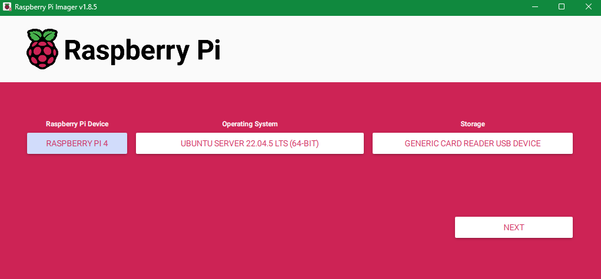
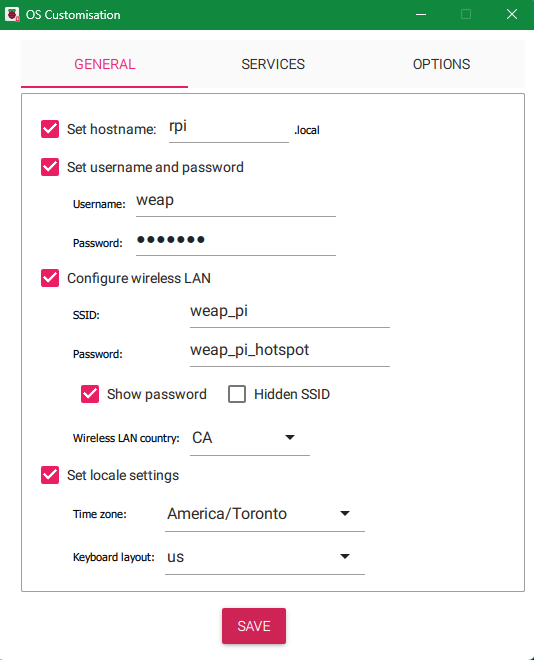
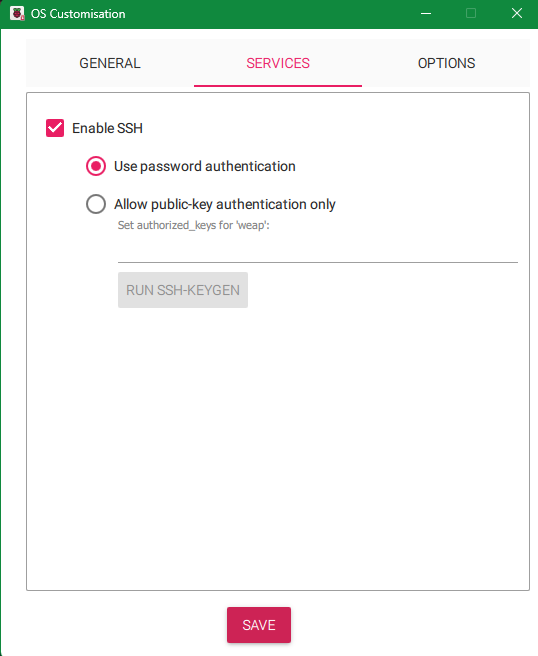
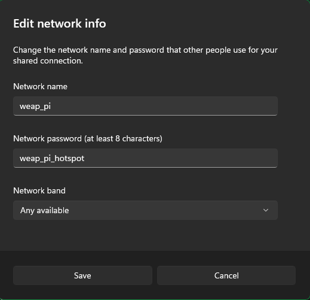
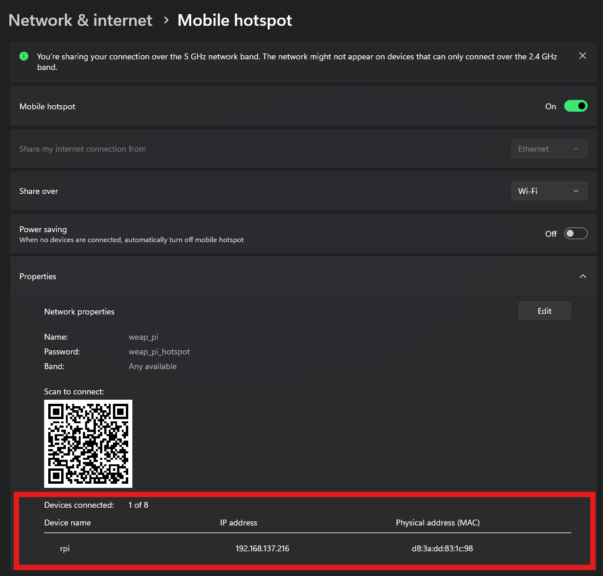

# Setup Development Instructions

## How to setup Raspberry Pi for development with SSH

### Flash the Raspberry Pi's SD Card with Ubuntu Server 22.04

1. If you do not have Raspberry Pi imager installed, install that [here](https://www.raspberrypi.com/software/)

2. Connect your SD Card to your device and flash it with the following settings:



3. Once you click "Next" and it prompts you to use OS Customization click **"Edit Settings"**

***Note that these settings can be changed but please remember them the entire time as we will be referencing them throughout.***

<div style="display: flex;">
    
    
</div>

The Password I have set is weap_pi, I recommend you set something similar in simplicity.


### Setup Device Hotspot (Windows, not sure about Mac)

- Settings -> Network & Internet -> Mobile Hotspot
- Turn on Mobile Hotspot
- Edit the properties to the configuration you set in the OS in the previous step for Wireless LAN.

<div style="display: flex; justify-content: center;">
    
</div>

</br>

### Connecting to the Raspberry Pi

1. Once the flashing is completed, unplug the SD Card and plug it into the Raspberry Pi and the Raspberry Pi into power.

2. SSH into the user you created in step 3 of flashing the Raspberry Pi

- Find your Raspberry Pi's IP Address from settings under "Devices Connected"

- Open a terminal (PowerShell on Windows)
- Type in the following command:

```bash
ssh username@ip.address
```
Where username is what you set in your OS Configuration previously and the IP Address is what you found in the previous step.

### Install all dependencies to develop with WEAP

- Follow the following commands step-by-step to install Python version 3.10.14 and Pyenv to manage your versions.
- If you do not understand any of these steps feel free to ask in the Discord server found on our GitHub Organization page and a lead/exec will answer right away :)

***Note: Some of these commands may take a while, so pelase be patient.***
```bash
# ------------------------------------------
# 1. Update system and install dependencies
# ------------------------------------------
sudo apt update && sudo apt upgrade -y

# Install packages needed to compile Python from source
sudo apt install -y make build-essential libssl-dev zlib1g-dev \
  libbz2-dev libreadline-dev libsqlite3-dev wget curl llvm \
  libncurses5-dev libncursesw5-dev xz-utils tk-dev libffi-dev \
  liblzma-dev git

# ------------------------------------------
# 2. Install pyenv using the official script
# ------------------------------------------
curl https://pyenv.run | bash

# ------------------------------------------
# 3. Configure your shell to load pyenv
#    - Append lines to your ~/.bashrc
# ------------------------------------------
echo 'export PATH="$HOME/.pyenv/bin:$PATH"' >> ~/.bashrc
echo 'eval "$(pyenv init --path)"' >> ~/.bashrc
echo 'eval "$(pyenv init -)"' >> ~/.bashrc

# Reload your shell configuration
source ~/.bashrc

# ------------------------------------------
# 4. Install a Python version 3.10.14
# ------------------------------------------
pyenv install 3.10.14

# ------------------------------------------
# 5. Set the installed Python as global default
# ------------------------------------------
pyenv global 3.10.14

# ------------------------------------------
# 6. Verify the active Python version
# ------------------------------------------
python --version
```


### Connect the LiDAR

- Make sure you have plugged in the LiDAR sensor to one of the USB ports on your Raspberry Pi (We will use USB 0 for this example).

</br>

1. Install LiDAR ROS2 Package
```bash
cd ~

mkdir -p ldlidar_ros2_ws/src

cd ldlidar_ros2_ws/src

git clone  https://github.com/WE-Autopilot/Sensor_Setup.git .
```

2. Setup System with our version of LiDAR ***(For the year 2024- 2025 we are using the STL-19P LiDAR Sensor)***

    - Set the -x permission for the serial port device mounted by the radar in the system (for example, /dev/ttyUSB0)

```bash
cd ~/ldlidar_ros2_ws

sudo chmod 777 /dev/ttyUSB0
```

In actual use, the LiDAR can be set according to the actual mounted status of your system, you can use `ls -l /dev` command to view.

- Create launch file corresponding to the LiDAR Model

```bash
cd ~/ldlidar_ros2_ws/src/ldlidar_stl_ros2/launch/

sudo nano stl19p.launch.py

# Copy the code from the stl19p.launch.py file in the launch directory in this repository to the new file and exit & save.
```
- Create viewer file corresponding to the LiDAR Model

```bash
cd ~/ldlidar_ros2_ws/src/ldlidar_stl_ros2/launch/

sudo nano viewer_stl19p.launch.py

# Copy the code from the viewer_stl19p.launch.py file in the launch directory in this repository to the new file and exit & save.
```


3. Build & Run

- We build with colcon so we must install that first:

```bash
pip3 install -U colcon-common-extensions colcon-ros
```

```bash
cd ~/ldlidar_ros2_ws

colcon build
```

After the compilation is completed, you need to add the relevant files generated by the compilation to the environment variables, so that the ROS environment can recognize them. 

This command is to temporarily add environment variables to the terminal, which means that if you reopen a new terminal, you also need to re-execute the following command.

```bash
cd ~/ldlidar_ros2_ws

source install/setup.sh
```

In order to never need to execute the above command to add environment variables after reopening the terminal, you can do the following.

```bash
echo source ~/ldlidar_ros2_ws/install/setup.sh >> ~/.bashrc

source ~/.bashrc
```

### Start the LiDAR


- Before you run the LiDAR you ened to install ROS 2

```py
# Install necessary tools
sudo apt update
sudo apt install -y curl gnupg lsb-release

# Add the ROS 2 apt repository key and repository
sudo curl -sSL https://raw.githubusercontent.com/ros/rosdistro/master/ros.key -o /usr/share/keyrings/ros-archive-keyring.gpg

echo "deb [arch=$(dpkg --print-architecture) signed-by=/usr/share/keyrings/ros-archive-keyring.gpg] http://packages.ros.org/ros2/ubuntu $(lsb_release -cs) main" | sudo tee /etc/apt/sources.list.d/ros2.list > /dev/null

# Update and install the base ROS 2 packages (May take a while)
sudo apt update
sudo apt install -y ros-humble-ros-base
sudo apt install ros-humble-rviz2
sudo apt install libogre-1.12-dev
```
```bash
# Automatically source in every new terminal, add the following line to your ~/.bashrc:

nano ~/.bashrc

echo "source /opt/ros/humble/setup.bash" >> ~/.bashrc
```


- Start stl19p lidar node:

Do `source ~/ldlidar_ros2_ws/install/setup.sh` first then either:

```bash
ros2 launch ldlidar_stl_ros2 stl19p.launch.py
```

- Start stl19p lidar node and show on the Rviz2:
```bash
ros2 launch ldlidar_stl_ros2 viewer_stl19p.launch.py
```

### View Data and Rviz2

Open a new terminal for this AFTER you start the node.

- To view the node data:

```bash
ros2 topic list
ros2 topic echo /scan
```
